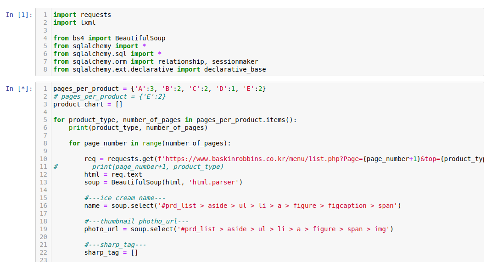
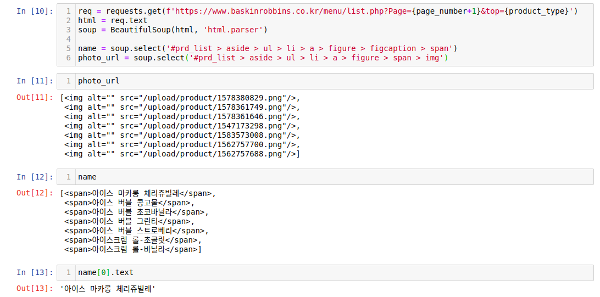
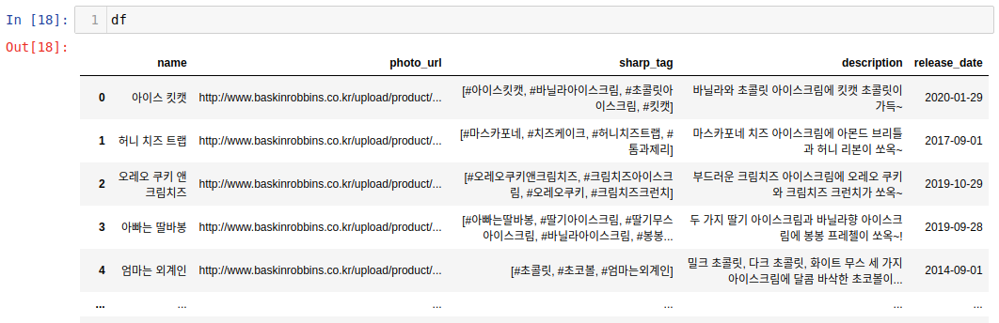

# 1. Jupyter notebook과 Pandas 사용하기

파이썬 라이브러리를 활용해서 웹 페이지 크롤링을 할 때에는, 불러온 자료들을 그때 그때, 한 줄 한 줄 확인하는 것이 더 편하다고 생각한다. 그래서 블럭 단위로 코드를 실행시킬 수 있는 jupyter notebook을 활용하기로 했다.

## jupyter notebook 설치

웹 크롤링을 위한 설정이 구축된 가상환경을 하나 실행시키고, 그 환경에 jupyternotebook을 설치한다. 나는 `pip`를 사용하였다.

```bash
conda activate scrap01
pip install jupyter
jupyter notebook
```

셸에서 바로 실행시키면 된다.  
블럭씩 실행시키는 방법 -> `shift+enter`



오랜만에 쓰는 주피터 노트북 반가워 ㅎ.ㅎ

## jupyter notebook을 활용하면!



```python
photo_url
name
name[0]_url
```

결과를 바로바로 볼 수 있어서 너무 좋다.  
아래는 참고로 기입해놓은 베스킨 라빈스 메뉴페이지를 크롤링 할 때 사용한 코드

```python
req = requests.get(f'https://www.baskinrobbins.co.kr/menu/list.php?top=A')
html = req.text
soup = BeautifulSoup(html, 'html.parser')

name = soup.select('#prd_list > aside > ul > li > a > figure > figcaption > span')
photo_url = soup.select('#prd_list > aside > ul > li > a > figure > span > img')
sharp_tag = []

for i in range(1, len(name)+1):

    sharp_tags_for_each_menu = soup.select(f'ul > li:nth-child({i}) > div > div > div > ul > li > a')
    sharp_tag.append([])
    for j in range(len(sharp_tags_for_each_menu)):
        sharp_tag[i-1].append(sharp_tags_for_each_menu[j].text)

#---ice cream short description and release date---
# 1. collect product detail url to get the description

product_urls = soup.findAll('a', {'class':'product'})
product_url_list = []
for url in product_urls:
    try:
        product_url_list.append('http://www.baskinrobbins.co.kr/menu/'+url['href'])
    except:
        print(None)
# 2. 각 url 속으로 들어가서 description 긁어오기
description = []
release_date = []

for url in product_url_list:
    req = requests.get(url)
    html = req.text
    soup = BeautifulSoup(html, 'lxml')
    description.append(soup.select('#content > div.inner_content > div.view_wrap > article > header > p'))
    release_date.append(soup.select('#content > div.inner_content > div.view_wrap > article > div > p.date'))

# MAKE DATASET
for item in zip(name, photo_url, sharp_tag, description, release_date):
        product_chart.append(
        {
            'name': item[0].text,
            'photo_url': 'http://www.baskinrobbins.co.kr'+item[1]['src'],
            'sharp_tag': item[2],
            'description': item[3][0].text.strip()
        })
        if item[4]:
            product_chart[-1]['release_date'] = item[4][0].text.strip()[-10:]
        else:
            product_chart[-1]['release_date'] = None
```

## Pandas 활용하기

크롤링 한 자료를 `product_chart`라는 변수에 저장하였다. 이를 바로 Django에 연결한 MySQL에 저장해도 좋지만, 그리 추천할 수 있는 방법은 아니다.

**1. 생성한 자료를 csv 파일로 저장한다.**  
**2. csv 파일을 불러와서 MySQL table에 저장한다.**

번거로워도 이게 더 낫다. 저장하기 전에, 데이터 프레임으로 표 모양으로 미리 보고, 또 편하게 자료를 가공하기 위해 **pandas 모듈**을 사용할 것이다.

```python
import pandas as pd
df = pd.DataFrame(product_chart)
```

이렇게 만들고 `df` 변수를 확인해보자

그냥 이렇게 볼 수 있다니..
지금은 'release_date'가 필요없고, 행의 시작 index도 0부터 시작이 아니라 1부터 시작이었으면 좋겠다.

```python
df.drop(columns = ['release_date'])
df.index = df.index+1
```

pandas는 데이터베이스 테이블에서 사용할 수 있는 기능은 거의 다 구현이 가능한 것 같다.  
inner_join, left_join 같은 **join** 함수나 **select** 등은 당연히 포함된다.

# 2. pandas 데이터 프레임 csv로 저장한 뒤, MySQL DB에 저장하기

## csv로 저장하기

이제, 이 데이터 프레임 그대로 csv로 저장할 것이다.

```python
df.to_csv('./br_product_list', sep = '$') # 어떤 기호로 seperation 할 지 결정해줌
```

그럼 이제 같은 디렉토리에 br_product_list 라는 파일이 생성되었다.

## csv 파일 MySQL 테이블에 밀어넣기

우선, 원하는 데이터베이스를 생성해놓아야 하고, 그 데이터베이스 안에 테이블도 생성되어 있어야한다.

```mysql
> create database baskin_robbins character set utf8mb4 collate utf8mb4_general_ci;
> use starbucks
# 나는 테이블을 Django 모델을 migrate하여 products라는 테이블을 미리 만들어 두었다.
> desc products;
+-------------+--------------+------+-----+---------+----------------+
| Field       | Type         | Null | Key | Default | Extra          |
+-------------+--------------+------+-----+---------+----------------+
| id          | int(11)      | NO   | PRI | NULL    | auto_increment |
| name        | varchar(45)  | NO   |     | NULL    |                |
| photo_url   | varchar(200) | NO   |     | NULL    |                |
| sharp_tag   | varchar(45)  | NO   |     | NULL    |                |
| description | longtext     | NO   |     | NULL    |                |
+-------------+--------------+------+-----+---------+----------------+
```

자~~~~~ 내 베스킨라빈스 자료를 밀어 넣어보자~~~~~~

```sql
LOAD DATA INFILE '/home/soheon-lee/Development/WECODE/devel/web_scraping/BaskinRobbins/br_product_list'
INTO TABLE products
FIELDS TERMINATED BY '$'
LINES TERMINATED BY '\n';
```

확인해보자

```sql
show databases;
use basin_robbins
show tables;
select * from products;

| id  | name                  | photo_url                                                     | sharp_tag                                                                                 | description                                                           |
+-----+-----------------------+---------------------------------------------------------------+-------------------------------------------------------------------------------------------+-----------------------------------------------------------------------+
|   1 | 아이스 킷캣            | http://www.baskinrobbins.co.kr/upload/product/1654067239.png  | ['#아이스킷캣', '#바닐라아이스크림', '#초콜릿아이스크림', '#킷캣']                            | 바닐라와 초콜릿 아이스크림에 킷캣 초콜릿이 가득~                         |
|   2 | 허니 치즈 트랩         | http://www.baskinrobbins.co.kr/upload/product/1559982007.png  | ['#마스카포네', '#치즈케이크', '#허니치즈트랩', '#톰과제리']                                  | 마스카포네 치즈 아이스크림에 아몬드 브리틀과 허니 리본이 쏘옥~            |
|   3 | 오레오 쿠키 앤 크림치즈 | http://www.baskinrobbins.co.kr/upload/product/1623256634.png  | ['#오레오쿠키앤크림치즈', '#크림치즈아이스크림', '#오레오쿠키', '#크림치즈']                   | 부드러운 크림치즈 아이스크림에 오레오 쿠키와 크림치즈 크런치가 쏘옥~      |
```

후.. 됐다 !

## reference

1. https://www.mysqltutorial.org/import-csv-file-mysql-table/

```toc

```
